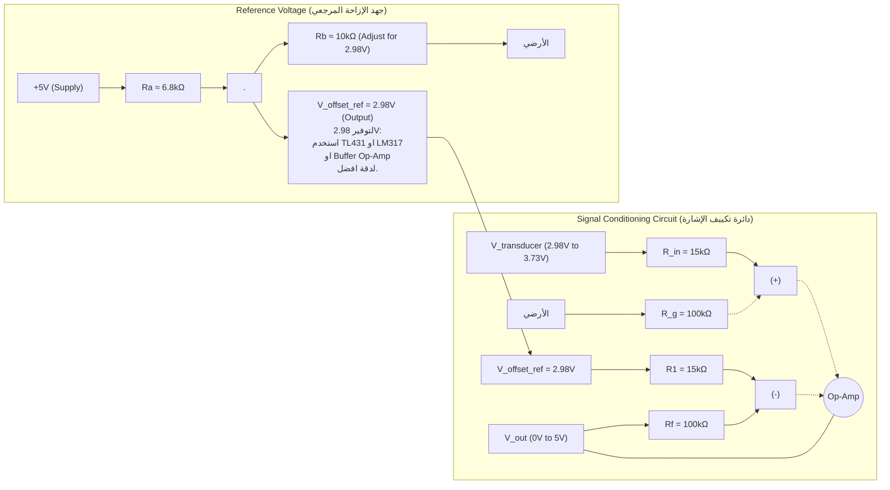

**1. تحليل معطيات مغير الطاقة الحرارية (المتحسس):**

*   **درجة الحرارة المرجعية:** 25 درجة سيليزيوس.
*   **حساسية المتحسس فوق 25 درجة مئوية:** 10 مللي فولت / درجة سيليزيوس (0.01 فولت / درجة سيليزيوس).
*   **جهد الخرج عند 25 درجة مئوية (T_min):** V_in_min = 2.98 فولت.
*   **جهد الخرج عند 100 درجة مئوية (T_max):** V_in_max = 3.73 فولت.
*   **مدى تغير درجة الحرارة:** ΔT = 100°C - 25°C = 75°C.
*   **مدى تغير جهد دخل المتحسس:** ΔV_in = V_in_max - V_in_min = 3.73 فولت - 2.98 فولت = 0.75 فولت.
    (وهذا يتوافق مع الحساسية: 75°C * 0.01 فولت/°C = 0.75 فولت).

**2. تحليل متطلبات الخرج لدائرة التكييف:**

*   **جهد الخرج الأدنى (عند 25 درجة مئوية):** V_out_min = 0 فولت.
*   **جهد الخرج الأقصى (عند 100 درجة مئوية):** V_out_max = 5 فولت.
*   **مدى تغير جهد الخرج المطلوب:** ΔV_out = V_out_max - V_out_min = 5 فولت - 0 فولت = 5 فولت.

**3. حسابات دائرة التكييف:**

نحتاج إلى عمليتين أساسيتين:
    أ. **إزاحة المستوى (Offset adjustment):** يجب أن نجعل جهد الدخل الذي قيمته 2.98 فولت (عند 25 درجة مئوية) يقابله 0 فولت في الخرج. هذا يعني أننا بحاجة لطرح 2.98 فولت من إشارة الدخل.
    ب. **التكبير (Gain):** بعد إزاحة المستوى، نحتاج لتكبير مدى الجهد المتبقي (0.75 فولت) ليصبح 5 فولت.

*   **الكسب (Gain, G) المطلوب:**
    G = ΔV_out / ΔV_in = 5 فولت / 0.75 فولت = 6.666... (أو 20/3)

**4. تصميم الدائرة باستخدام مكبر العمليات:**

يمكن استخدام دائرة **المكبر التفاضلي (Differential Amplifier)** لتحقيق كل من الإزاحة والتكبير في مرحلة واحدة.
صيغة المكبر التفاضلي هي:
V_out = (Rf/R1) * (V2 - V1)
حيث:
*   V2 هو جهد دخل المتحسس (V_transducer).
*   V1 هو جهد مرجعي ثابت للإزاحة (V_offset_ref).
*   Rf و R1 هي مقاومات تحدد الكسب.

لتطبيق هذا على مشكلتنا:
*   نريد V_out = G * (V_transducer - V_offset_value)
*   لذا، V_offset_value يجب أن تكون 2.98 فولت.
*   والكسب Rf/R1 = G = 20/3.

**اختيار قيم المقاومات:**
لتكن R1 = 15 كيلو أوم.
إذن Rf = G * R1 = (20/3) * 15 كيلو أوم = 100 كيلو أوم.

للحصول على أفضل أداء للمكبر التفاضلي، يجب أن تكون المقاومات كالتالي:
R1 (متصل بـ V_offset_ref إلى المدخل السالب) = R_in (متصل بـ V_transducer إلى المدخل الموجب)
Rf (مقاومة التغذية الراجعة من الخرج إلى المدخل السالب) = R_g (مقاومة من المدخل الموجب إلى الأرضي)

إذن:
*   R1 = 15 كيلو أوم
*   Rf = 100 كيلو أوم
*   R_in (مقاومة الدخل للطرف الموجب) = 15 كيلو أوم
*   R_g (مقاومة الطرف الموجب للأرضي) = 100 كيلو أوم

بهذه الطريقة تصبح معادلة الخرج:
V_out = (Rf/R1) * (V_transducer_at_positive_input_node - V_offset_ref)
ولكن لتبسيط الدائرة التفاضلية القياسية:
V_out = (Rf/R1) * (V_plus_effective - V_minus_effective)

إذا استخدمنا التكوين القياسي للمكبر التفاضلي:
V_out = (R4/(R3+R4)) * (1 + Rf/R1) * V_transducer - (Rf/R1) * V_offset_ref (إذا V_transducer على الطرف الموجب و V_offset_ref على الطرف السالب).
أو بصورة أبسط وأكثر شيوعاً:
V_out = (Rf/R1) * (V_transducer - V_offset_ref) إذا كانت R_in=R1 و R_g=Rf.
V_transducer يطبق على المدخل الموجب بعد مجزئ جهد (R_in, R_g).
V_offset_ref يطبق على المدخل السالب عبر R1.

لنستخدم التكوين الكلاسيكي للمكبر التفاضلي حيث:
*   جهد المتحسس (V_transducer) يدخل إلى مقاومة R_A ثم إلى المدخل الموجب لمكبر العمليات.
*   مقاومة R_B من المدخل الموجب إلى الأرضي.
*   جهد الإزاحة المرجعي (V_offset_ref = 2.98V) يدخل إلى مقاومة R_C ثم إلى المدخل السالب لمكبر العمليات.
*   مقاومة التغذية الراجعة R_D من الخرج إلى المدخل السالب.

للحصول على V_out = (R_D/R_C) * (V_transducer_effective - V_offset_ref):
يجب أن يكون (R_D/R_C) = (R_B/R_A).
والكسب التفاضلي (R_D/R_C).
V_transducer_effective هو الجهد على المدخل الموجب الفعلي.

**الطريقة الأبسط للتصميم:**
V_out = G * (V_transducer - V_ref)
G = Rf/R1 = 20/3
V_ref = 2.98 V

1.  صل V_transducer بالمدخل غير العاكس (+) لمكبر العمليات.
2.  صل V_ref بالمدخل العاكس (-) لمكبر العمليات.
3.  هذا ليس مكبر تفاضلي قياسي. يجب استخدام دائرة مكبر تفاضلي.

**دائرة المكبر التفاضلي القياسية:**
*   V1 (مثلاً V_offset_ref) يتصل بـ R1 ثم بالمدخل العاكس (-).
*   Rf من الخرج إلى المدخل العاكس (-).
*   V2 (مثلاً V_transducer) يتصل بـ R_in ثم بالمدخل غير العاكس (+).
*   R_g من المدخل غير العاكس (+) إلى الأرضي.
*   الشرط: R1 = R_in و Rf = R_g.
*   في هذه الحالة: V_out = (Rf/R1) * (V2 - V1).

نختار:
*   V1 = V_offset_ref = 2.98 V
*   V2 = V_transducer
*   R1 = R_in = 15 kΩ
*   Rf = R_g = 100 kΩ

**توليد الجهد المرجعي V_offset_ref = 2.98 V:**
يمكن استخدام مجزئ جهد من مصدر جهد مستقر (مثلاً +5V إذا كان متاحاً ومناسباً لتغذية مكبر العمليات).
V_offset_ref = V_supply * (R_b / (R_a + R_b))
2.98V = 5V * (R_b / (R_a + R_b))
R_b / (R_a + R_b) = 2.98 / 5 = 0.596
إذا افترضنا R_a = 10 kΩ:
R_b = 0.596 * (10 kΩ + R_b)
R_b = 5.96 kΩ + 0.596 R_b
0.404 R_b = 5.96 kΩ
R_b = 5.96 / 0.404 ≈ 14.75 kΩ.
يمكن استخدام مقاومة 14.7 kΩ (قيمة قياسية قريبة) أو مقاومة متغيرة (بوتنشوميتر) قيمتها مثلاً 20 kΩ لضبط دقيق.
من الأفضل استخدام منظم جهد دقيق مثل TL431 أو LM317 أو استخدام مكبر عمليات آخر كـ "voltage follower" بعد مجزئ الجهد لضمان عدم تحميل المجزئ.

**مخطط الدائرة:**

**شرح المخطط:**
1.  **V_transducer:** هو خرج مغير الطاقة الحرارية (2.98 فولت إلى 3.73 فولت).
2.  **V_offset_ref:** هو الجهد المرجعي الثابت (2.98 فولت) الذي يتم طرحه.
3.  **Op-Amp:** مكبر العمليات.
4.  **المقاومات:**
    *   R_in = 15 kΩ (مقاومة الدخل للطرف غير العاكس من V_transducer)
    *   R_g = 100 kΩ (مقاومة من الطرف غير العاكس إلى الأرضي)
    *   R1 = 15 kΩ (مقاومة الدخل للطرف العاكس من V_offset_ref)
    *   Rf = 100 kΩ (مقاومة التغذية الراجعة)
5.  **V_out:** هو الخرج المكيف (0 فولت إلى 5 فولت).

**التحقق من عمل الدائرة:**
*   **عند T = 25°C:**
    V_transducer = 2.98 V
    V_offset_ref = 2.98 V
    V_out = (100kΩ/15kΩ) * (2.98V - 2.98V) = (20/3) * 0V = 0V. (صحيح)

*   **عند T = 100°C:**
    V_transducer = 3.73 V
    V_offset_ref = 2.98 V
    V_out = (100kΩ/15kΩ) * (3.73V - 2.98V) = (20/3) * 0.75V = (20/3) * (3/4)V = 20/4 V = 5V. (صحيح)

**ملاحظات هامة:**
*   يجب اختيار مكبر عمليات مناسب. إذا كانت الدائرة تعمل بتغذية أحادية (Single Supply)، يجب اختيار مكبر عمليات يستطيع العمل قريباً من جهد الأرضي (Rail-to-Rail Output) أو على الأقل LM358/LM324 الذي يمكنه الوصول إلى ما يقارب 0 فولت في الخرج عند التغذية الأحادية.
*   يجب أن تكون تغذية مكبر العمليات أعلى من أقصى جهد خرج مطلوب (أعلى من 5 فولت، مثلاً +9 فولت أو +12 فولت إذا كانت تغذية أحادية).
*   دقة الجهد المرجعي V_offset_ref مهمة جداً لدقة الخرج الكلي. يفضل استخدام منظم جهد دقيق أو دائرة ضبط دقيقة.

هذا التصميم يحقق المتطلبات بتحويل مدى دخل المتحسس (2.98V إلى 3.73V) إلى مدى خرج (0V إلى 5V).