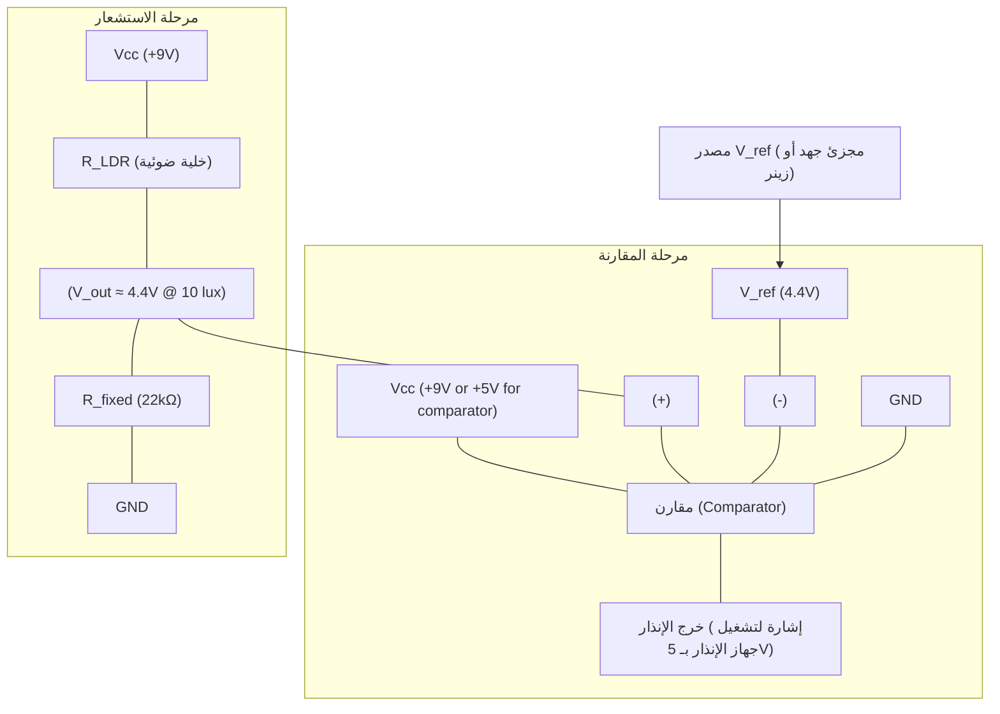

# تمارين (۷)

**٧-١ ما هي نماذج تشغيل الدايود الضوئي؟**
بناءً على النص (صفحة ١٨٣، OCR صفحة ١٢):
يمكن أن تعمل الدايودات الضوئية في إحدى الأسلوبين:
1.  **أسلوب كهرضوئي (Photovoltaic mode):** حيث يحول الدايود الضوء مباشرة إلى جهد.
2.  **أسلوب ذو موصلية ضوئية (Photoconductive mode):** حيث يعمل الدايود في انحياز عكسي وتتغير مقاومته (وبالتالي التيار المار فيه) بتغير شدة الضوء الساقط عليه.

**٧-٢ بفرض أن مقاوم يعتمد على الضوء مقاومته في الظلام ١ ميجا أوم ومقاومته في الضوء ١ كيلو أوم. ما هو مدى جهود الخرج المتوقع من دائرة مجزئ الجهد عندما نستعمل ١ كيلو أوم ثابت مع المقاوم الذي يعتمد على الضوء؟**
سنفترض أن جهد الدخل (ف دخل) لدائرة مجزئ الجهد هو **١٢ فولت** كما في المثال (أ) المذكور في النص (صفحة ١٨٠، OCR صفحة ٩) حيث أن السؤال لم يحدد قيمة جهد الدخل.
الدائرة مكونة من مقاوم ثابت (م معايرة) ومقاوم يعتمد على الضوء (مقاومة الخلية الضوئية). الجهد الخارج (ف خرج) عبر المقاوم الثابت هو:
ف خرج = ف دخل × (م معايرة / (م معايرة + م مقاومة تعتمد على الضوء))
هنا، المقاوم الثابت (م معايرة) = ١ كيلو أوم. جهد الخرج سيُقاس عبر هذا المقاوم الثابت.

*   **في الظلام:**
    مقاومة تعتمد على الضوء = ١ ميجا أوم = ١٠٠٠ كيلو أوم
    م معايرة = ١ كيلو أوم
    ف خرج = ١٢ فولت × (١ ك.أوم / (١ ك.أوم + ١٠٠٠ ك.أوم))
    ف خرج = ١٢ فولت × (١ / ١٠٠١)
    ف خرج ≈ ٠.٠١١٩٨ فولت ≈ **٠.٠١٢ فولت (أو ١٢ ميللي فولت)**

*   **في الضوء:**
    مقاومة تعتمد على الضوء = ١ كيلو أوم
    م معايرة = ١ كيلو أوم
    ف خرج = ١٢ فولت × (١ ك.أوم / (١ ك.أوم + ١ ك.أوم))
    ف خرج = ١٢ فولت × (١ / ٢)
    ف خرج = **٦ فولت**

إذن، مدى جهود الخرج المتوقع هو **من حوالي ٠.٠١٢ فولت (في الظلام) إلى ٦ فولت (في الضوء)**، بافتراض أن جهد الدخل هو ١٢ فولت وأن الخرج يُقاس عبر المقاوم الثابت ذي القيمة ١ كيلو أوم.
(ملاحظة: إذا كان المقصود أن الخرج يُقاس عبر المقاوم الضوئي، ستكون القيم مختلفة).

**٧-٣ بفرض أن دايود ضوئي له معدل تيار في الظلام ٥ نانو أمبير ومعدل التيار في الضوء ٥٠ ميكرو أمبير ما هو مدى جهد الخرج المتوقع أن ينتج من خرج مكبر التشغيل بفرض أن مقاومة التغذية الخلفية ١٠٠ كيلو أوم؟**
بناءً على النص (صفحة ١٨٦، OCR صفحة ١٥) ومعادلة خرج مكبر التشغيل (المحول تيار إلى فولت):
ف خرج = - ت(د) × م(ت خ)
حيث:
ت(د) = تيار الدايود
م(ت خ) = مقاومة التغذية الخلفية = ١٠٠ كيلو أوم = ١٠٠ × ١٠^٣ أوم

*   **في الظلام:**
    ت(د) = ٥ نانو أمبير = ٥ × ١٠^-٩ أمبير
    ف خرج = - (٥ × ١٠^-٩ أمبير) × (١٠٠ × ١٠^٣ أوم)
    ف خرج = - (٥٠٠ × ١٠^-٦ فولت) = -٠.٠٠٠٥ فولت = **-٠.٥ ميللي فولت**

*   **في الضوء:**
    ت(د) = ٥٠ ميكرو أمبير = ٥٠ × ١٠^-٦ أمبير
    ف خرج = - (٥٠ × ١٠^-٦ أمبير) × (١٠٠ × ١٠^٣ أوم)
    ف خرج = - (٥٠٠٠ × ١٠^-٣ فولت) = **-٥ فولت**

إذن، مدى جهد الخرج المتوقع هو **من -٠.٥ ميللي فولت (في الظلام) إلى -٥ فولت (في الضوء)**.

**٧-٤ ما هو فرق التشغيل الأساسي بين الدايود الضوئي والترانزستور الضوئي؟**
بناءً على النص (صفحة ١٩٠، OCR صفحة ١٩):
الفرق الهام بين الترانزستور الضوئي والدايود الضوئي هو **كمية التيار التي يمكن لأي جهاز نقلها**. يمكن لشدة ضوئية معطاة أن ينتج الترانزستور الضوئي تيار خرج أكثر من الدايود الضوئي، وذلك بسبب مقدرة التكبير (الكسب) المبنية داخلياً فيه. فالترانزستور الضوئي أكثر حساسية لتغيرات الضوء وينتج تياراً أكبر.

**٧-٥ بفرض أن الباعث للترانزستور الضوئي وصل بالأرض والمجمع وصل لمصدر جهد قيمته +٥ فولت خلال مقاومة ١٠ كيلو أوم كما هو موضح بالشكل.**
**(أ) ما هي قيمة جهد الخرج في الظلام التام؟**
**(ب) ما هي قيمة جهد الخرج في ضوء الشمس الساطع؟**
الشكل يوضح أن جهد الخرج (V_out) هو الجهد على المجمع (Collector).
بناءً على المثال المشابه في (صفحة ١٩٢، OCR صفحة ٢١) وسلوك الترانزستور كمفتاح:

*   **(أ) في الظلام التام:**
    يكون الترانزستور الضوئي في حالة قطع (OFF). لا يمر تيار تقريباً عبر مقاومة المجمع (١٠ كيلو أوم). بالتالي، لا يوجد هبوط في الجهد عبر هذه المقاومة.
    إذن، جهد الخرج (جهد المجمع) ≈ جهد المصدر = **+٥ فولت**.

*   **(ب) في ضوء الشمس الساطع:**
    يكون الترانزستور الضوئي في حالة إشباع (ON). يعمل كمفتاح مغلق. الجهد بين المجمع والباعث (V_CE(sat)) يكون صغيراً جداً (عادة حوالي ٠.٢ فولت للترانزستورات السيليكونية، أو يمكن اعتباره صفر فولت بشكل مثالي). بما أن الباعث موصول بالأرض (صفر فولت)، فإن جهد المجمع (وهو جهد الخرج) سيكون V_CE(sat).
    إذن، جهد الخرج ≈ **٠ فولت (بشكل مثالي) أو حوالي ٠.٢ فولت (بشكل عملي)**.

**٧-٦ اشرح كيف يمكن أن يستعمل نموذج المقطع الضوئي لقياس الوضع الزاوي؟**
يُستخدم نموذج المقطع الضوئي لقياس الوضع الزاوي عن طريق تثبيت قرص مشفر (عجلة فك الشفرة) على المحور الدوار المراد قياس وضعه الزاوي. هذا القرص يحتوي على عدد من الشقوق الطولية (الفتحات) موزعة بانتظام أو عند مواضع زاوية محددة على محيطه.
يتم وضع نموذج المقطع الضوئي (الذي يتكون من مصدر ضوء ومستقبل ضوئي متقابلين وبينهما فجوة) بحيث يمر القرص المشفر خلال هذه الفجوة.
عند دوران القرص:
1.  عندما يمر جزء معتم من القرص بين مصدر الضوء والمستقبل، يُحجب الضوء ولا تصل إشارة للمستقبل (أو تكون ضعيفة).
2.  عندما يمر شق (فتحة) من القرص أمام المقطع الضوئي، يسمح للضوء بالمرور من المصدر إلى المستقبل، مما ينتج نبضة كهربائية عند خرج المستقبل (الترانزستور الضوئي في المقطع).
بتعيين عدد الشقوق التي مرت أو بتصميم القرص بشقوق فريدة لكل وضع زاوي، يمكن لدائرة تحكم أو معالج دقيق حساب هذه النبضات وتحديد الوضع الزاوي الدقيق للمحور. كلما زاد عدد الشقوق على القرص، زادت دقة قياس الوضع الزاوي.

**٧-٧ ما هي أنواع أجهزة الإحساس الضوئية المتكاملة؟**
بناءً على النص (صفحة ١٩٢، OCR صفحة ٢١):
يوجد نوعين من أجهزة الإحساس الضوئية المتكاملة التي تم مناقشتها في النص:
1.  **نموذج المقطع الضوئي (Slotted optical switch / Interrupter module).**
2.  **نموذج العاكس الضوئي (Reflective optical switch / Reflective module).**

**٧-٨ صمم دائرة توظف خلية ذو موصلية ضوئية كأداة إنذار للخطر في مستوى شدة الضوء. عندما تصل شدة الضوء إلى ١٠ لومنا/م٢ ، تطلق أداة الإنذار جهد قدرة ٥ فولت. سوف يزداد الجهد مع شدة الضوء (تبدي هذه الخلية مقاومة قدرها ٢٣ كيلو أوم عندما تكون شدة الضوء ١٠ لومنا/م٢).**

**فهم المتطلبات:**
*   المستشعر: خلية ذو موصلية ضوئية (LDR).
*   مقاومة LDR عند ١٠ لومنا/م٢ = ٢٣ كيلو أوم.
*   الإنذار: يطلق جهد ٥ فولت عندما تصل شدة الضوء إلى ١٠ لومنا/م٢ (أو تزيد).
*   سلوك الدائرة: "سوف يزداد الجهد مع شدة الضوء". هذا يعني أن جهد الخرج من دائرة المستشعر يزداد كلما زادت شدة الضوء.

**التصميم:**
نحتاج إلى دائرة يكون فيها جهد الخرج متناسبًا طرديًا مع شدة الضوء. بما أن مقاومة الخلية الضوئية (LDR) تقل مع زيادة شدة الضوء، سنستخدم دائرة مجزئ جهد بحيث يكون الخرج مأخوذاً عبر مقاوم ثابت، والخلية الضوئية في الجزء الآخر من المجزئ.

1.  **دائرة مجزئ الجهد:**
    *   مصدر جهد (Vcc).
    *   مقاومة الخلية الضوئية (R_LDR) موصلة على التوالي مع مقاومة ثابتة (R_fixed).
    *   ليزداد جهد الخرج (V_out) مع زيادة شدة الضوء (أي مع نقصان R_LDR)، يجب أن تكون R_LDR في الجزء العلوي من المجزئ والخرج V_out عبر R_fixed في الجزء السفلي، أو العكس مع أخذ الخرج بشكل مختلف.
    *   الصيغة التي تحقق "يزداد الجهد مع شدة الضوء" هي إذا كانت V_out عبر R_fixed:
        V_out = Vcc * (R_fixed / (R_LDR + R_fixed))
        عندما تزداد شدة الضوء، تقل R_LDR، فيزداد المقام بشكل أقل، أو يقل، مما يؤدي لزيادة V_out.

2.  **تحديد القيم:**
    *   عند ١٠ لومنا/م٢، R_LDR = ٢٣ كيلو أوم. عند هذه النقطة، يجب أن يتم تشغيل الإنذار (الذي يطلق ٥ فولت).
    *   سنفترض أن "جهد الخرج" من دائرة المستشعر هو الذي سيشغل مقارن (comparator) أو ترانزستور كمفتاح، والذي بدوره يشغل جهاز إنذار يعطي ٥ فولت.
    *   لنختر Vcc = ٩ فولت (قيمة شائعة).
    *   لنختر R_fixed بحيث يكون V_out عند ١٠ لومنا/م٢ قيمة مناسبة لتشغيل المقارن، مثلاً نصف Vcc أو أقل قليلاً.
        لنجعل R_fixed = ٢٢ كيلو أوم (قيمة قريبة من ٢٣ كيلو أوم لتكون الحساسية جيدة حول نقطة التشغيل).
        عند ١٠ لومنا/م٢ (R_LDR = ٢٣ ك.أوم):
        V_out = ٩ فولت * (٢٢ ك.أوم / (٢٣ ك.أوم + ٢٢ ك.أوم))
        V_out = ٩ فولت * (٢٢ / ٤٥)
        V_out = ٩ فولت * ٠.٤٨٨٨
        V_out ≈ ٤.٤ فولت

    *   عندما تزداد شدة الضوء أكثر، R_LDR ستقل. مثلاً لو أصبحت R_LDR = ٥ كيلو أوم:
        V_out = ٩ فولت * (٢٢ ك.أوم / (٥ ك.أوم + ٢٢ ك.أوم))
        V_out = ٩ فولت * (٢٢ / ٢٧)
        V_out = ٩ فولت * ٠.٨١٤٨
        V_out ≈ ٧.٣٣ فولت
        فعلاً، يزداد الجهد مع شدة الضوء.

3.  **دائرة الإنذار:**
    *   يتم إدخال V_out (من مجزئ الجهد) إلى المدخل غير العاكس (+) لمقارن (Op-Amp comparator).
    *   يتم إدخال جهد مرجعي (V_ref) قيمته ٤.٤ فولت (يمكن الحصول عليه بمجزئ جهد آخر أو زينر دايود) إلى المدخل العاكس (-).
    *   عندما يكون V_out > V_ref (أي عندما تصل شدة الضوء إلى ١٠ لومنا/م٢ أو تزيد)، سيكون خرج المقارن عالياً (مثلاً، قريب من Vcc).
    *   خرج المقارن يمكن أن يشغل ترانزستور كمفتاح، وهذا الترانزستور يشغل جهاز إنذار (مثل جرس أو ضوء LED) يعمل على ٥ فولت أو يتسبب في إطلاق جهد ٥ فولت. إذا كان جهاز الإنذار "يطلق جهد قدرة ٥ فولت"، فقد يكون هذا الخرج هو مصدر تغذية لدائرة أخرى أو إشارة منطقية.

**الرسم التخطيطي للدائرة المصممة (وصف):**
1.  **مرحلة الاستشعار:**
    *   مصدر جهد Vcc (مثلاً +٩ فولت).
    *   مقاومة R_LDR (الخلية الضوئية) موصلة من Vcc.
    *   مقاومة ثابتة R_fixed (مثلاً ٢٢ كيلو أوم) موصلة من الطرف الآخر لـ R_LDR إلى الأرضي (GND).
    *   نقطة الخرج V_out هي النقطة بين R_LDR و R_fixed.

2.  **مرحلة المقارنة والتشغيل:**
    *   V_out من مرحلة الاستشعار موصلة بالمدخل غير العاكس (+) لمقارن (مثل LM393 أو LM741 كـ comparator).
    *   جهد مرجعي V_ref (يساوي ٤.٤ فولت، يمكن الحصول عليه من مجزئ جهد آخر بقيم مثلاً ٤٤ك و ٤٦ك مع Vcc=٩فولت، أو باستخدام زينر دايود) موصل بالمدخل العاكس (-).
    *   خرج المقارن (V_comp_out) يشغل قاعدة ترانزستور NPN (مثل 2N2222) عبر مقاوم حماية للقاعدة (مثلاً ١ كيلو أوم).
    *   باعث الترانزستور موصل بالأرضي.
    *   مجمع الترانزستور موصل بأحد طرفي جهاز الإنذار (الذي يطلق ٥ فولت أو يعمل على ٥ فولت). الطرف الآخر لجهاز الإنذار (إذا كان يحتاج تغذية) سيوصل بمصدر ٥ فولت (إذا كان هو جهاز إنذار). أو إذا كان المقصود أن خرج المقارن هو الذي يمثل "جهد قدرة ٥ فولت"، فيمكن استخدام منظم جهد ٥ فولت بعد المقارن أو استخدام مقارن يعمل على تغذية ٥ فولت ويكون خرجه متوافقاً.

    بشكل أبسط، إذا كان جهاز الإنذار هو من يطلق الـ ٥ فولت كإشارة:
    عندما V_out > V_ref، فإن V_comp_out يكون HIGH. هذه الإشارة (بعد تكييفها إذا لزم الأمر لتكون ٥ فولت) هي إشارة الإنذار.

**شرح الرسم:**
*   مرحلة الاستشعار تولد الجهد V_out الذي يزداد مع زيادة شدة الضوء.
*   V_out يُقارن مع جهد مرجعي V_ref في المقارن.
*   إذا تجاوز V_out قيمة V_ref (عندما تصل شدة الضوء إلى ١٠ لومنا/م٢)، فإن خرج المقارن يصبح مرتفعاً، وهذه الإشارة هي "خرج الإنذار" التي يمكن استخدامها لتشغيل جهاز إنذار يعطي ٥ فولت، أو يمكن أن تكون هي نفسها إشارة ٥ فولت إذا كان المقارن يعمل على تغذية ٥ فولت وله خرج مناسب.