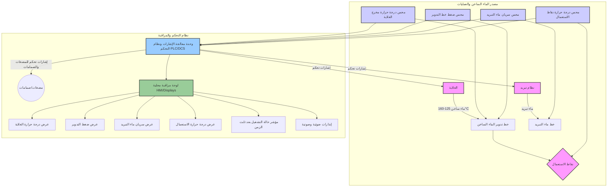

بناءً على المعلومات المستخلصة من الكتاب المرفق، إليك إجابة مفصلة:

**ب. المحسات/المغيرات اللازمة للمنظومة الصناعية لإمداد مصنع بماء ساخن:**

1.  **محس درجة حرارة (عند مخرج الغلاية):**
    *   **الدالة:** قياس درجة حرارة الماء الساخن الخارج مباشرة من الغلاية. يهدف للتأكد من أن درجة الحرارة ضمن المدى المطلوب (125 س° إلى 160 س°). يرسل هذا المحس إشارة (عادة كهربائية) إلى نظام التحكم والمعالجة.
    *   *(مرجع من الكتاب: الفصل الثالث "قياس الحرارة")*

2.  **محس ضغط (في خط تدوير الماء الساخن):**
    *   **الدالة:** قياس الضغط في نظام أنابيب تدوير الماء الساخن. يهدف للتأكد من أن الضغط ضمن المدى المتاح (8 بار إلى 10.5 بار). يرسل إشارة إلى نظام التحكم.
    *   *(مرجع من الكتاب: الفصل الثاني "قياس الضغط")*

3.  **محس سريان / مقياس سريان (لماء التبريد):**
    *   **الدالة:** قياس معدل تدفق ماء التبريد المستخدم "لإعادة تدوير الطلبات والمتطلبات الأخرى". يهدف للتأكد من أن معدل السريان لا يقل عن 15 جالون/دقيقة. يرسل إشارة إلى نظام التحكم.
    *   *(مرجع من الكتاب: الفصل الرابع "قياس السريان")*

4.  **محس درجة حرارة (عند نقاط الاستعمال أو خط التوزيع النهائي):**
    *   **الدالة:** قياس درجة حرارة الماء الساخن عند نقاط الاستعمال الفعلية أو في نقطة تمثل متوسط درجة حرارة الماء الواصل للمستخدمين. يهدف للتأكد من أن درجة الحرارة ضمن المدى المطلوب (50 س° إلى 60 س°). يرسل إشارة إلى نظام التحكم.
    *   *(مرجع من الكتاب: الفصل الثالث "قياس الحرارة")*

5.  **مؤقت و وحدة منطقية (لتأكيد إشارة التشغيل):**
    *   **الدالة:** لا يعتبر محسًا بالمعنى التقليدي لقياس متغير فيزيائي مستمر، ولكنه جزء من نظام التحكم. بعد بدء تشغيل المنظومة، يتم تفعيل مؤقت. عند انقضاء فترة زمنية تساوي ثابت زمن المنظومة (وهو مقياس لسرعة استجابة المنظومة للتغيرات)، تقوم وحدة منطقية في نظام التحكم بتأكيد "إشارة التشغيل" (مثلاً، إضاءة مصباح بيان أخضر أو إرسال حالة "مستقر" للنظام). هذا يشير إلى أن المنظومة قد وصلت إلى حالة تشغيل مستقرة ضمن المعطيات المطلوبة.
    *   *(مرجع من الكتاب: يمكن استنتاج الحاجة لمثل هذه الوظيفة من فهم "ثابت زمن المنظومة" المذكور في الفصل الأول، صفحة ٣٦ و ٣٧، ضمن "سرعة الاستجابة" و "زمن الاستجابة من الدرجة الأولى")*

**شكل منظومة لمعالجة الإشارات اللازمة وكيفية مراقبتها محليًا:**

**شرح مخطط المنظومة:**

1.  **المحسات (Sensors/Transducers):**
    *   تقوم المحسات (T1, P1, F1, T2) بقياس المتغيرات الفيزيائية (درجة حرارة، ضغط، سريان) وتحويلها إلى إشارات كهربائية (أو رقمية حسب نوع المغير).
    *   *(مرجع من الكتاب: الفصل الأول، صفحة ٢٨، تعريف "مغير الطاقة" و "نبائط الإحساس")*

2.  **وحدة معالجة الإشارات ونظام التحكم (Signal Processing and Control Unit):**
    *   تستقبل هذه الوحدة (مثل PLC أو DCS) الإشارات من المحسات المختلفة.
    *   تقوم بمعالجة هذه الإشارات (مثل الترشيح، التكبير، التحويل من تناظري إلى رقمي إذا لزم الأمر).
    *   *(مرجع من الكتاب: يمكن استنتاج الحاجة إلى معالجة من طبيعة عمل الأنظمة الرقمية والتحكم، وإن لم يفصل الكتاب في تصميم وحدات التحكم نفسها، لكنه يشير إلى تهيئة الإشارة في الفصل الأول)*
    *   تقارن القيم المقاسة مع القيم المطلوبة (Setpoints).
    *   تُصدر أوامر تحكم إلى المشغلات (Actuators) مثل صمامات التحكم في الغلاية، المضخات، صمامات التحكم في التدفق (لم تذكر صراحة في السؤال ولكنها ضرورية لعمل أي منظومة تحكم).
    *   تحتوي على منطق المؤقت لتفعيل "مؤشر حالة التشغيل" بعد استقرار النظام (مرور ثابت الزمن).

3.  **لوحة المراقبة المحلية (Local Monitoring Panel):**
    *   تعرض القيم الحالية للمتغيرات المقاسة (درجات الحرارة، الضغط، السريان) على شاشات رقمية أو واجهات رسومية (HMI).
    *   تعرض "مؤشر حالة التشغيل" للمنظومة.
    *   يمكن أن تحتوي على إنذارات ضوئية أو صوتية في حال تجاوز أي من المتغيرات للحدود المسموح بها.
    *   تتيح للمشغل المحلي مراقبة أداء المنظومة والتدخل إذا لزم الأمر.

هذا التصور يعتمد على مبادئ عامة في أنظمة التحكم الصناعي مع الاستناد إلى أنواع المحسات ووظائفها كما وردت في فصول الكتاب المرفق.